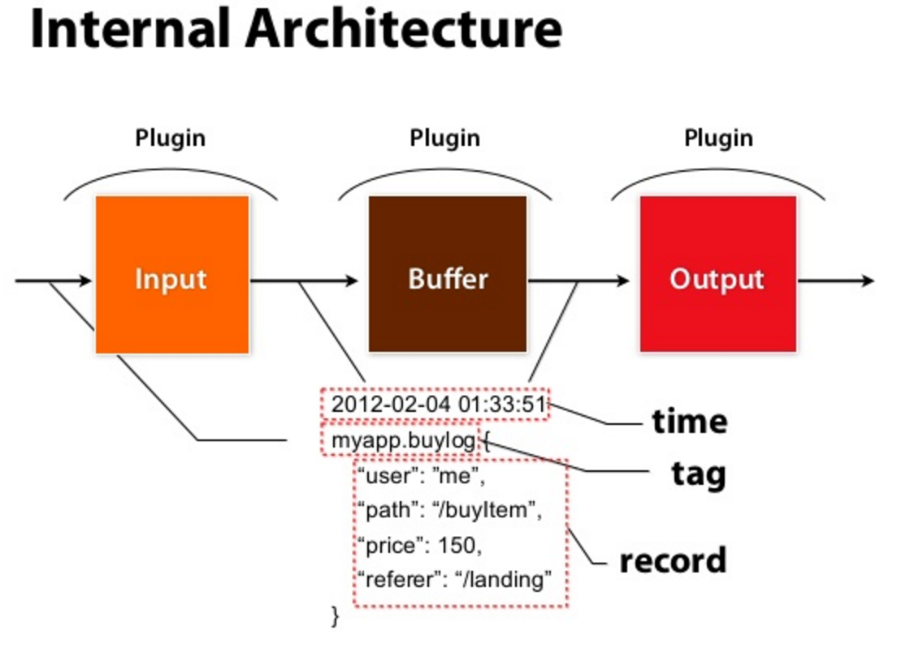
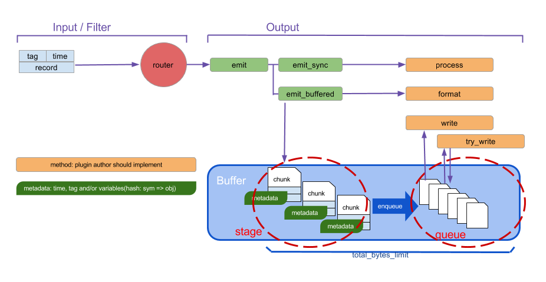

# Fluentd
     
Fluentd 는 오픈 소스 데이터 수집기로서 C 와 Ruby 를 이용해 작성되었음    
ELK 에서 Logstash 와 같이 로그를 수집하는데 Fluentd 를 많이 이용하고 있음    
ㄴ 필자도 회사에서 로그 수집에 Fluentd 를 사용하고 있다  
  
본글에서는 Fluentd 를 로그 수집기로써 사용한다는 가정하에 정리했다      

## Fluentd 를 이용한 로그 수집 아키텍쳐     

  
각 어플리케이션 서버에 설치된 Fluentd 는 로그 디렉토리를 주기적으로 감시하여 로그를 **로그 수집기** 서버로 전송한다  
ㄴ 로그 저장소로 바로 전송할 수 있지만 로그 수집기로 전송하는 것은 로그 저장소에 로그를 넣기 전에 트래픽을 Throttling (속도 조절)을 해서 로그 저장소의 용량에 맞게 트래픽을 조정을 할 수 있음   
로그 수집기 서버에서는 각종 플러그인을 이용하여 ES 나 하둡에 연결하에 로그를 저장할 수 있음     
일반적으로 로그 수집기 서버에서 로그를 파싱하여 로그 저장소에 저장한다  
ㄴ 예를들어 ES 저장한다고 할 경우 ES 에서 검색을 최적화 하기 위해서 여러 플러그인을 이용하여 로그를 파싱할 수 있다  
ㄴ 개인적으로 어플리케이션 서버에서 로그를 파싱하지 않는 이유는 로그 파싱은 해당 서버의 역할이 아니며, 로그를 파싱을 하면서 발생한 에러가 서비스에 최대한 영향을 주지 않게 하기 위함이라고 생각함   

## 데이터 
Fluentd 가 내부적으로 어떻게 로그 데이터를 핸들링 하는지 살펴보자  
    
- 출처: https://pt.slideshare.net/frsyuki/fluentd-set-up-once-collect-more  
   
데이터는 크게 3가지 파트로 구성됨  
- Tag: 데이터의 분류를 나타냄 (식별자?)  
각 Record 는 Tag 를 통해서 Record 의 종류가 정해지고 Tag 를 이용해서 Record 에 대한 필터링, 라우팅 등과 같은 추가작업을 지정함  
- Time: 데이터의 생성 시간 
- Record: 데이터의 내용 (JSON)

## Fluentd 내부 구조 
Fluentd 는 총 7개의 컴포넌트로 구성됨  
  
츨처: [조대협님 블로그](https://bcho.tistory.com/1115)
  
- Input
로그를 수집하는 플러그인으로 다양한 로그 소스를 지원함  
HTTP, tail, TCP 등 기본 플러그인 이외에도 확장 플러그인을 통해서 다양한 서버나 어플리케이션으로 부터 다양한 포맷의 데이터를 수집할 수 있도록 함  
  
- Parser (optional)  
Input 플러그인을 통해서 읽은 데이터를 파싱하는데 사용하는 플러그인으로 정규식 기반으로 문자열을 파싱하는 플러그인, apache 나 nginx 등의 로그를 파싱하는 플러그인 등이 있다  

- Filter (optional)  
읽은 데이터를 output 으로 보내기 전에 아래의 3가지 기능을 수행할 수 있음 
1. 필터링: 필터링은 원하는 형식의 데이터만 필터링 해서 데이터를 output 으로 전달하는 것을 의미한다
2. 데이터 필드 추가: 들어온 데이터에 특정 필드를 추가하는 행위인데, 일반적으로 로그를 수집한 호스트 정보를 추가하여서 output 으로 전달하기도 함  
3. 데이터 필드 삭제 or 특정 필드 마스킹: 불필요한 데이터를 삭제하거나 개인정보 등으로 민감한 정보를 마스킹하는 기능을 제공     
    
- Buffer (Optional)  
Input 에서 들어온 데이터를 Output 으로 바로 전달하는 것이 아니라 Buffer 를 선택적으로 둬서 Throttling 을 할 수 있음  
버퍼는 file 과 memory 버퍼가 있으며 성능을 추구하는 경우는 memory 를 데이터의 유실이 민감한 경우는 file 버퍼를 이용하면 된다
ㄴ 필자는 로그 수집기 서버에서 file buffer 를 구성함 
ㄴ 실제로는 buffer 라는 디렉토리에 각 파일들이 저장되는 방식
  
버퍼는 tag 별로 chunk 세트로 구성됨   
ㄴ chunk 는 직역하면 **덩어리** 라는 의미인데 많은 양의 데이터를 처리하기 위해 여러 레코드들을 묶어서 **덩어리 화** 했다고 생각하면 됨

- Output  
Input 을 거쳐 앞에서 전달해준 데이터를 데이터 저장 솔루션에 데이터를 저장하는 역할을 수행  

- Formatter (optional)  
Output 플러그인을 통해서 데이터를 저장소에 전송할 때 Formatter 를 이용하면 전송할 데이터의 포맷을 정의할 수 있음  
  
위에서 제공하는 필수 플러그인 외에도 여러 플러그인이 존재하는데, [Fluentd 플러그인 공식](https://docs.fluentd.org/) 를 참고하여 사용하면 됨     

### buffering and output
Output 플러그인에는 buffering 과 flushing 에 대한 3가지 모드가 존재함  
- Non-Buffered mode : 데이터를 버퍼링 하지 않음 (거의 사용되지 않을듯)
- Synchronous Buffered mode : 순서가 있는 버퍼 chunk, 큐 chunk 를 가지며 동작방식은 아래 그림참조    
- Asynchronous Buffered mode : Synchronous Buffered mode 와 동일하지만, 동기적으로 바로 output 에 전달하지 않고 비동기식으로 전달  
   
      
버퍼 플러그인 내부에는 크게 2가지로 구성되는데 **stage** 와 **queue** 이다  
- stage 는 input 에서 전달받은 event 를 채움 
ㄴ event 가 record 인 거 같음   
- queue 는  chunk 가 output 으로 전송기 전에 대기하는 queue 
새로 생성된 chunk 는 stage 에서 시작한 다음 queue 로 enqueue 되었다가 실제 저장소로 전달됨  
ㄴ chunk 는 chunk_limit 에 도달하거나 정의된 flush_interval 주기가 되면 queue 에 enqueue 됨       

### flush
- flush_mode: flush 의 모드를 지정 (default: 기본, lazy, interval, immediate)
ㄴ interval 은 flush_interval 주기별로 chunk 를 비우는 것을 의미
- flush_interval: chunk 를 비우는 주기 (default: 60s)
ㄴ flush_mode 가 interval 이여야 함  
- flush_thread_count: 버퍼를 비울 스레드 수 (default: 1)
- flush_thread_interval: flush 스레드에서 버퍼 flush 를 검사 시간 (default: 1.0) 
- flush_thread_burst_interval: buffer chunk 가 queue 대기 할때 flush 사이에 대기할 시간 (default: 1.0) 
- delayed_commit_timeout: output 플러그인에서 버퍼 chunk 를 commit 하는 시간 (전달) (default: 60)
- slow_flush_log_threshold: chunk flush 성능 검사의 임계 값 
ㄴ chunk flush 가 임계 값보다 오래 걸리면 warn/error 로그가 출력됨 
```log
2016-12-19 12:00:00 +0000 [warn]: buffer flush took longer time than slow_flush_log_threshold: elapsed_time=15.0031226690043695 slow_flush_log_threshold=10.0 plugin_id="foo"
```
- overflow_action: 버퍼 큐가 가득 찬 경우 동작 제어 3가지 모드가 있음 
    * throw_exception: 기본 모드로써 입력 플러그인에 예외를 발생시킴 (BufferOverflowError) - 주로 스트리밍 방식  
    * block: 버퍼 가득참이 해결될 때까지 입력 플러그인의 스레드를 중지함 - 주로 배치 방식   
    ㄴ 이 방식을 추천하지 않는 방식으로 주로 다른 플러그인에서 사용하는 방식  
    * drop_oldest_chunk: 가장 오래된 청크를 삭제하는 방식  
    ㄴ 시스템 모니터링을 하는데 유용함  

### 재시도 동작 제어 
queue 에서 실제 저장소로 데이터를 전달하면서 실패가 발생할 경우에 fluentd 는 재시도 메커니즘을 제공하고 있음    
- retry_wait: 저장소로 데이터 전달에 실패했을 경우 대기하는 시간을 나타냄 
ㄴ fluentd 는 retry 에서 실패할 경우 해당 시간을 2배로 올린후 재시도를 수행  
ㄴ ex) retry_wait 1s 라면, 처음 재시도는 1초후, 그 다음 재시도는 2초 ... 이런식    
- retry_randomize: True 인 경우 fluentd 는 무작위로 시간을 지정함 (0.87 ~ 1.125 초)  
- retry_max_interval: 재시도 실패시 늘어난 시간의 max 값 지정  
ㄴ 위 예에서 retry_max_interval 을 3으로 지정하면 여러번 실패를 하더라도 항상 3s 후에 재시도 수행  
- retry_max_times: 최대 재시도 횟수 
- retry_timeout: 첫번째 지시도 후 경과된 시간 (default: 72)  
ㄴ 처음 재시도 이후 해당 시간이 지나면 재시도를 수행하지 않음  
ㄴ retry_max_times, retry_timeout 을 설정하게 되면 큐가 삭제 되기 때문에 retry_forever 값을 지정해서 큐 삭제를 방지할 수 있음  

### 복구할 수 없는 에러 
모든 에러를 복수할 수 있는 것은 아니기 때문에 fluentd 에서는 복구할 수 없는 에러가 발생하면 chunk 를 중단하고 backup 디렉토리로 옮김    
복구할 수 없는 에러로 간주하는 에러들  
- Fluent::UnrecoverableError : 출력 플러그인은 해당 에러를 이용해서 복구 불가능한 오류에 대해서 추가 재시도를 방지하기 위해서 사용 
- TypeError: 대상 필드에 예기치 않은 유형이 있을 때 발생 
- ArgumentError: 플러그인이 라이브러리를 잘못 사용하면 발생 
- NoMethodError: 이번트와 구성이 일치하지 않을 때 발생  
복구할 수 없는 예외가 


## Reference
- [fluentd 공식](https://www.fluentd.org/)
- [fleuntd buffer 플러그인](https://docs.fluentd.org/buffer)
- [fluentd_output_플러그인](https://docs.fluentd.org/output)
- [네이버 클라우드 플랫폼 medium](https://medium.com/naver-cloud-platform/%EC%9D%B4%EB%A0%87%EA%B2%8C-%EC%82%AC%EC%9A%A9%ED%95%98%EC%84%B8%EC%9A%94-fluentd-%ED%99%9C%EC%9A%A9%ED%95%98%EC%97%AC-object-storage%EC%97%90-%EB%A1%9C%EA%B7%B8-%EC%A0%80%EC%9E%A5%ED%95%98%EA%B8%B0-7b2f55c671c6)
- [조대협님 블로그](https://bcho.tistory.com/1115)
- [사다유키_발표자료](https://pt.slideshare.net/frsyuki/fluentd-set-up-once-collect-more)
