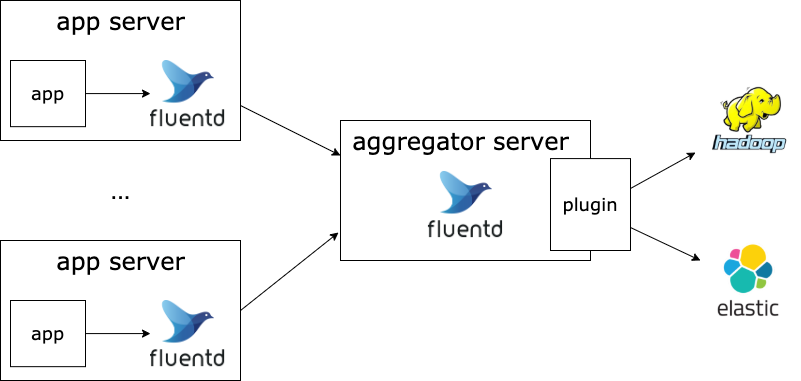

# Fluentd
     
Fluentd 는 오픈 소스 데이터 수집기로서 C 와 Ruby 를 이용해 작성되었음    
ELK 에서 Logstash 와 같이 로그를 수집하는데 Fluentd 를 많이 이용하고 있음    
ㄴ 필자도 회사에서 로그 수집에 Fluentd 를 사용하고 있다  
  
본글에서는 Fluentd 를 로그 수집기로써 사용한다는 가정하에 정리했다      

## Fluentd 를 이용한 로그 수집 아키텍쳐     

  
각 어플리케이션 서버에 설치된 Fluentd 는 로그 디렉토리를 주기적으로 감시하여 로그를 **로그 수집기** 서버로 전송한다  
ㄴ 로그 저장소로 바로 전송할 수 있지만 로그 수집기로 전송하는 것은 로그 저장소에 로그를 넣기 전에 트래픽을 Throttling (속도 조절)을 해서 로그 저장소의 용량에 맞게 트래픽을 조정을 할 수 있음   
로그 수집기 서버에서는 각종 플러그인을 이용하여 ES 나 하둡에 연결하에 로그를 저장할 수 있음     
일반적으로 로그 수집기 서버에서 로그를 파싱하여 로그 저장소에 저장한다  
ㄴ 예를들어 ES 저장한다고 할 경우 ES 에서 검색을 최적화 하기 위해서 여러 플러그인을 이용하여 로그를 파싱할 수 있다  
ㄴ 개인적으로 어플리케이션 서버에서 로그를 파싱하지 않는 이유는 로그 파싱은 해당 서버의 역할이 아니며, 로그를 파싱을 하면서 발생한 에러가 서비스에 최대한 영향을 주지 않게 하기 위함이라고 생각함   

## Fluentd 내부 구조 
Fluentd 는 총 7개의 컴포넌트로 구성됨  
  
츨처: [조대협님 블로그](https://bcho.tistory.com/1115)
  
- Input
로그를 수집하는 플러그인으로 다양한 로그 소스를 지원함  
HTTP, tail, TCP 등 기본 플러그인 이외에도 확장 플러그인을 통해서 다양한 서버나 어플리케이션으로 부터 다양한 포맷의 데이터를 수집할 수 있도록 함  
  
- Parser (optional)  
Input 플러그인을 통해서 읽은 데이터를 파싱하는데 사용하는 플러그인으로 정규식 기반으로 문자열을 파싱하는 플러그인, apache 나 nginx 등의 로그를 파싱하는 플러그인 등이 있다  

- Filter (optional)  
읽은 데이터를 output 으로 보내기 전에 아래의 3가지 기능을 수행할 수 있음 
1. 필터링: 필터링은 원하는 형식의 데이터만 필터링 해서 데이터를 output 으로 전달하는 것을 의미한다
2. 데이터 필드 추가: 들어온 데이터에 특정 필드를 추가하는 행위인데, 일반적으로 로그를 수집한 호스트 정보를 추가하여서 output 으로 전달하기도 함  
3. 데이터 필드 삭제 or 특정 필드 마스킹: 불필요한 데이터를 삭제하거나 개인정보 등으로 민감한 정보를 마스킹하는 기능을 제공     
    
- Buffer (Optional)  
Input 에서 들어온 데이터를 Output 으로 바로 전달하는 것이 아니라 Buffer 를 선택적으로 둬서 Throttling 을 할 수 있음  
버퍼는 file 과 memory 버퍼가 있으며 성능을 추구하는 경우는 memory 를 데이터의 유실이 민감한 경우는 file 버퍼를 이용하면 된다  
ㄴ 필자는 로그 수집기 서버에서 file buffer 를 구성함 

- Output  
Input 을 거쳐 앞에서 전달해준 데이터를 데이터 저장 솔루션에 데이터를 저장하는 역할을 수행  

- Formatter (optional)  
Output 플러그인을 통해서 데이터를 저장소에 전송할 때 Formatter 를 이용하면 전송할 데이터의 포맷을 정의할 수 있음  
  
위에서 제공하는 필수 플러그인 외에도 여러 플러그인이 존재하는데, [Fluentd 플러그인 공식](https://docs.fluentd.org/) 를 참고하여 사용하면 됨  

## 데이터 구조 

  

## 목적 
- Fluentd 라는 로그 수집기를 활용하여 Object Storage 에 저장하는 과정 

- td-agent: 루비로 작성된 fluentd 를 쉽게 사용할 수 있게 해주는 래퍼 프로그램

## Reference
- [fluentd 공식](https://www.fluentd.org/)
- [네이버 클라우드 플랫폼 medium](https://medium.com/naver-cloud-platform/%EC%9D%B4%EB%A0%87%EA%B2%8C-%EC%82%AC%EC%9A%A9%ED%95%98%EC%84%B8%EC%9A%94-fluentd-%ED%99%9C%EC%9A%A9%ED%95%98%EC%97%AC-object-storage%EC%97%90-%EB%A1%9C%EA%B7%B8-%EC%A0%80%EC%9E%A5%ED%95%98%EA%B8%B0-7b2f55c671c6)
- [조대협님 블로그](https://bcho.tistory.com/1115)
