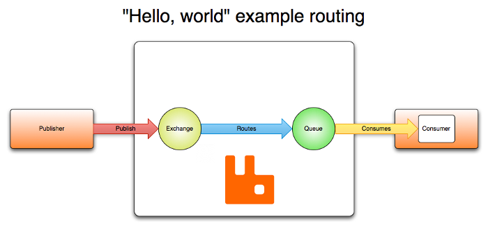

# RabbitMQ
RabbitMQ 는 AMQP(Advanced Message Queuing Protocol) 룰 구현한 고성능 message broker   
ㄴ RabbitMQ 와 유사 제품으로 아파치 재단의 Kafka 등이 있음  
RabbitMQ 는 erlang 이라는 언어로 개발됨  

## RabbitMQ 서버 기본 개념
- Producer : 메시지를 보내는 응용 프로그램 (메시지를 공급)
- Consumer : 메시지를 받는 응용 프로그램 (메시지를 소비)
- Queue : 메시지를 저장하는 버퍼 
- Message : RabbitMQ 를 통해 전송할 정보 (데이터의 단위라고 볼 수 있음)
- Connection : 어플리케이션과 RabbitMQ 간의 TCP 연결정보를 나타냄  
- Channel : Connection 내부의 가성의 connection 으로 큐에서 메시지를 게시하거나 사용할 때 채널을 통해서 수행됨   
- Exchange : Producer 가 전송한 메시지를 Exchange 에 정의된 규칙에 따라서 큐로 전송함  
ㄴ Exchange 가 생성되어 있어도 Queue 에 바인딩 되어 있지 않으면 메시지가 큐에 전송되지 않기 때문에 Consumer 는 메시지를 소비할 수 없음  
- Binding : 큐와 Exchange 간의 메시지 전송하는 링크와 같은 개념 (라우팅 룰?)
- Routing Key : Exchange 가 메시지를 큐로 라우팅하는 방법을 결정하기 위해서 사용하는 key   
ㄴ 메시지의 주소로 볼 수 있음  
- Users : RabbitMQ 에 접속가능한 사용자들을 말함  
ㄴ 각 사용자는 Vhost 별로 읽기, 쓰기 권한을 지정할 수 있음   
ㄴ 최초에 RabbitMQ 를 설치하면 guest(guest) 유저가 생성됨  
- Vhost (Virtual host) : 동일한 RabbitMQ 에 여러 어플리케이션이 사용할 수 있는 일종의 namespace 와 같은 개념  
ㄴ Vhost 기반으로 각 사용자의 권한 관리가 가능하며 큐, Exchange 등을 따로 관리 할 수 있음   
  
## 특징 
- 신뢰성  
RabbitMQ 는 지속성, 전송 확인, 게시자 확인 및 고 가용성을 포함한 안정성과 성능을 교환할 수 있는 다양한 기능을 갖음   
- 유연한 라우팅  
메시지는 큐에 도작하기 전에 exchange 를 통해서 라우팅 됨  
exchange 에 라우팅을 위한 기본 라우팅 유형을 제공하며 복잡한 라우팅을 위해서 exchange + binding 을 작성하고나 라우팅 관련 플러그인을 이용할 수 있음   
- 클러스터링  
여러 RabbitMQ 서버를 함께 클러스터링 하여 단일 논리 브로커를 형성할 수 있음  
- Federation  
클러스터링 허용보다 느슨하고 불안정하게 연결해야 하는 서버의 경우에는 Federation 모델을 제공함  
- 멀티 프로토콜  
RabbitMQ 는 다양한 메시징 프로토콜을 통한 메시징을 지원함  
- 다양한 클라이언트  
다양한 언어로 작성된 RabbitMQ 클라이언트가 존재함  
- Management UI  
RabbitMQ 를 쉽게 사용할 수 있는 WEB UI 를 지원 
- Tracing  
메시징 시스템이 오동작하는 경우 RabbitMQ 는 진행 상황을 파악할 수 있도록 추적 기능을 제공 
- 플러그인 시스템  
RabbitMQ 는 다양한 플러그인이 제공되며 직접 작성도 가능함  
- 커뮤니티 
다양한 클라이언트, 플로그인, 가이드 등에 대한 커뮤니티가 존재함  
ㄴ [RabbitMQ devtools](https://www.rabbitmq.com/devtools.html)   

## RabbitMQ 를 쓰는 이유
RabbitMQ 와 같은 메시지 브로커는 여러 어플리케이션의 중개자 역할을 수행   
메시지 브로커를 이용해서 리소스가 많이 드는 작업을 다른 어플리케이션이 수핻하도록 구성할 수 있음  
  
사용자의 요청에 따라 웹 사이트는 pdf 를 생성하여 이메일로 pdf 를 전송한다고 가정해보자  
ㄴ 사용자의 요청에 맞는 데이터를 생성하고 pdf 만드는 작업은 리소스가 많이 드는 작업으로 볼 수 있음    
이때 우리는 이메일로 전송할 pdf 를 생성하는 작업을 다른 어플리케이션으로 구성할 수 있다  
ㄴ 웹 어플리케이션에 부하를 줄이고 pdf 생성과 이메일 전송하는 작업을 분리 하는 것  
중간에 메시지 브로커를 위치 시키면 메시지를 생성하는 웹 사이트와 pdf 를 생성하는 worker 간의 의존성을 낮출 수 있음          
  
   
   
1. 사용자는 PDF 생성 요청을 웹 사이트로 전송
2. 웹 사이트는 사용자의 요청에 해당하는 메시지를 RabbitMQ 로 전송
3. RabbitMQ 는 해당 메시지를 Exchange 에 배치 시킨뒤 binding 규칙에 따라 Queue 에 복사
4. pdf 를 생성하는 worker 는 주기적으로 RabbitMQ 의 Queue 에 메시지를 가져와 pdf 처리

## AMQP(Advanced Message Queuing Protocol)  
클라이언트가 메시지 미들웨어 브로커와 통신할 수 있게 해주는 **메시징 프로토콜**   

- producer 가 메시지를 발행하면 broker 의 Exchange 로 전달 
- Exchange 는 Binding 규칙에 의해서 메시지를 다시 Queue 로 전달
- consumer 에서는 queue 에서 해당 메시지를 가져감 
  
producer 가 메시지를 전달할 때 메타 데이터를 함께 전달이 가능한데, 해당 메타 데이터를 브로커나 consumer 에서 사용가능함  
consumer 가 메시지를 가져가는 것이 실패할 수 있기 때문에 RabbitMQ 는 메시지를 바로 삭제하지 않고 대기하다가 consumer 가 메시지 수신이 성공했다고 
메시지 브로커에서 알림을 준다  
 
### AMQP 엔티티
RabbitMQ 의 exchange, queue, binding 을 통틀어 AMQP 엔티티라고 함  
어플리케이션, 관리자는 라우팅 방식을 정의해서 사용 가능  

## Exchange
Exchange 속성들 
- Exchange 유형 : Exchange 가 Queue 
- 이름
- 내구성: Exchange 는 브로커 재시작 후에도 지속됨
- 자동 삭제: 마지막 큐가 바인딩 해제되면 exchange 는 삭제됨
- 파라미터: optional, 플러그인 및 브로커 별 기능에서 사용함

### Exchange 유형 
- Direct exchange: amq.direct 또는 빈 문자열 
- Fanout exchange: amq.fanout
- Topic exchange: amq.topic
- Headers exchange: amq.match (RabbitMQ 에서 amq.headers)

### Default exchange
큐를 생성하면 MQ 가 기본적으로 생성하는 Exchange 유형으로 이름이 없는 direct exchange  
예를 들어 "search-indexing-online" 이름으로 큐를 생성하면 MQ 는 기본적으로 "search-indexing-online" 이라는 라우팅 키로 큐에 바인딩함  

### Direct exchange
메시지의 라우팅 키를 기반으로 큐에 메시지를 전달하는 방법  
direct exchange 는 unicast 라우팅에 적합함  

### Fanout exchange
메시지들을 라우팅 키는 무시하고 바인드된 모든 큐에 라우팅하는 방법  
N 개의 큐가 fanout exchange 에 바인드 되어있다면 n 개의 큐 모두에 복사본을 전달함  
메시지를 broadcast 에 주로 사용함   

  

### Topic exchange
메시지를 이미 exchange 에 등록된 큐 중에서 라우팅 키에 대해서 패턴매칭이 되는 경우 전달하는 방법  
일반적으로 multicast 에 주로 사용함  

### Headers exchange
라우팅 키 대신 메시지 헤더에 여러 속성들에 의해서 큐에 라우팅하는 방식  
큐는 header exchange 에 한 개 이상의 헤더 속성과 매칭해서 바인딩할 수 있음  
개발자는 MQ 로 "x-match" 라는 속성을 추가로 전달해야함  
ㄴ x-match 는 any, all 값을 가질수 있음  
ㄴ any: 헤더 값의 한개만 매칭되어도 만족
ㄴ all: 모든 헤더 값이 일치해야 만족  

## Queue
AMQP 모델의 Queue 는 메시지를 저장하고 consumer 에 의해서 메시지를 소비함  
RabbitMQ 의 Queue 의 속성
- Name
- Durable : MQ 재시작 후 큐를 유지할 지를 설정
- Exclusive : 하나의 연결에서만 사용되고 해당 연결이 닫히면 큐를 삭제 
- Auto-delete : 최종 소비지가 구독을 취소하면 큐가 삭제 
- Arguments : 메시지 TTL, 큐 길이 제한 등과 같은 플러그인 및 MQ 의 인수를 지정  

### Name
어플리케이션 (consumer) 은 큐 이름을 선택하여 사용할 수 있음  
큐 이름은 최대 255 바이트의 UTF-8 문자  
"amq" 로 시작하는 큐 이름은 MQ 내부적으로 사용하기 때문에 해당 이름으로 시작하는 큐를 생성하면 403 에러가 발생함  

### Durability
- durable : 큐의 메타 데이터를 영구저장하는 방법  
durable queue 는 durable exchange 와만 결합 할 수 있음   
- transient : 큐의 메타 데이터를 메모리에 저장하는 방법 

## Bindings
exchange 로 메시지가 publish 된 경우 큐로 라우팅에 사용되는 규칙  
예를들어 exchange "E" 에 메시지를 queue "Q" 에 전달하려면 바인딩이 되어 있어야 함 
만약 바인딩 되어 있지 않은 exchange 에 메시지가 전달된 경우 해당 메시지는 삭제되거나 publisher 에게 리턴됨  

## Consumer
- Push API : 메시지를 구독하는 방식으로 MQ 에서 권장하는 방법 
- Pull API : 폴링을 이용해서 메시지를 받아오는 방식으로 매우 비효율적임  
큐 마다 여러 Consumer 를 등록할 수 있고 1 개의 Consumer 만 등록하게 할 수 있음  
각 Consumer 의 구독은 consumer tag 라는 식별자가 있으며 구독을 취소하는데 사용할 수 있다  

## Message Acknowledgements
Consumer 가 큐에서 메시지를 consume 하는 경우 네트워크 문제 or Consumer 어플리케이션 상의 문제로 consume 을 실패할 수 있음  
따라서 MQ 에서는 큐에서 메시지를 제거하는 시점을 설정할 수 있음  
- 자동 ack 모델: basic.deliver or basic.get-ok 메서드 사용  
MQ 클라이언트에서 메시지를 정상적으로 수신 했을경우 MQ 서버에 성공여부를 전달하는 방법  
- 명시적 ack 모델: basic.ack 사용 
이 방법은 승인을 보낼 시간을 선택함  
메시지를 수신 한 직후 또는 메시지를 처리하기 전, 후에 명시적으로 MQ 에 메시지 삭제를 요청하는 방법  
  
Consumer 가 ack 를 전달하지 않으면 MQ 는 다른 Consumer 에게 메시지를 재전송함  
ㄴ 즉 큐에서 사라지지 않는다는 얘기 

## Rejecting Message
Consumer 에서 메시지를 받았을 경우 에러가 발생하는 경우가 존재할 수 있는데 MQ 에게 해당 메시지를 거부할 수 있음  
메세지를 거부하지 않으면 MQ 와 Consumer 간의 실패하는 메시지로 인한 무한루프에 빠질 수 있음  
basic.reject 메서드를 이용해서 메시지를 거부 할 수 있음  

## Prefetching Message
여러 consumer 가 큐를 공유하는 경우 consumer 가 다음 ack 를 보내기 전에 각 consumer 로 한 번에 보낼 수 있는 메시지 수를 지정할 수 있음  
간단한 로드 밸런싱이나 메시지가 배치로 처리되는 경우 처리량 향상에 도움이 될 수 있음  
예를 들어 publisher 가 1분 마다 메시지를 보내는 경우 유용할 수 있음  
RabbitMQ 는 채널 레벨의 prefetch 만 지원함  

## Message Attributes and Payload 
메시지 속성
- content type
- content encoding
- routing key
- delivery mode
- message priority
- message publishing timestamp
- expiration period
- publisher application id
  
일부 속성은 MQ 가 사용하며, 대부분의 속성은 consumer 에서 사용할 수 있음   
  
메시지에는 payload (메시지가 갖고 있는 데이터) 가 있으며 MQ 는 payload 를 불투명한 바이트 배열로 취급하여 payload 를 검사하거나 수정하지 않음    
메시지는 payload 없이 속성만을 포함할 수 도 있음  
JSON, Thrift, Protocol Buffer, MessagePack 과 같은 직렬화 형식을 사용하여 구조화된 데이터를 직렬화하여 메시지 payload 로 사용함  
ㄴ 일반적으로 "content-type", "content-encoding" 필드를 이용하여 이 정보를 전달함  

## Exchange Method 
- exchange.declare
- exchange.declare-ok
- exchange.delete
- exchange.delete-ok
 

## 래퍼런스 
- [RabbitMQ 위키](https://en.wikipedia.org/wiki/RabbitMQ)
- [cloudamqp](https://www.cloudamqp.com/docs/index.html)
- [RabbitMQ 특징](https://www.rabbitmq.com/features.html)
- [RabbitMQ devtools](https://www.rabbitmq.com/devtools.html)